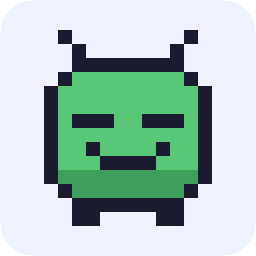
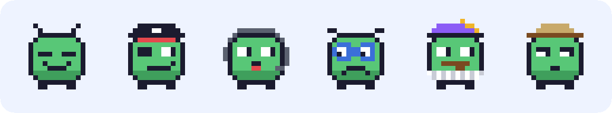
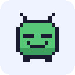

<div align="center">



# ErrorBuddy

**Your code has an error. Buddy has opinions.**

A VS Code extension that roasts your bugs, explains them in plain English,
shows you the fix, and throws confetti when you get it right.




</div>

---

## 🤔 Why?

Here's what a beginner sees when they make a typo:

```
Cannot find name 'userNmae'. Did you mean 'userName'? ts(2552)
```

Cold. Confusing. A little rude. Error messages read like a parking ticket.

**ErrorBuddy turns that moment into three things:**

| | Layer | Example |
|---|---|---|
| 😈 | **The roast** | *"`userNmae` doesn't exist. Neither do your plans."* |
| 💡 | **What happened** | *"You used `userNmae`, but you only ever created `userName`. It's like calling a friend by the wrong name: nobody answers."* |
| 🔧 | **How to fix it** | *"On line 7, change `userNmae` to `userName`."* + a **Go to line** button |

Then you fix it, and Buddy celebrates. 🎉

---

## ✨ Features

| | Feature | What it does |
|---|---|---|
|  | **Instant detection** | Watches the red squiggles in your open file and reacts about 1.5 s after you stop typing. |
|  | **AI explanations** | Claude writes a fresh roast, a no-jargon explanation and a 1–2 step fix for *your* exact code. |
|  | **Works offline** | No API key or no internet? Built-in answers cover the most common JavaScript/TypeScript errors. |
| 🔊 | **Spoken roasts** | Buddy reads the roast out loud, with comic timing: a reaction, a pause, then the punchline. |
|  | **Streaks** | Every fix adds to your streak, shown in the panel and in the status bar (`🔥 3 ErrorBuddy`). |
|  | **Achievements** | Six to unlock, from *First Blood* to *Legendary Hunter*. |
| ⚡ | **Legendary errors** | Rare (or really long) errors get a golden panel, a gold line highlight and an extra dramatic roast. |
| 🖍️ | **Line highlight** | The line Buddy is talking about glows in your editor, so you never hunt for it. |
|  | **Profile page** | Your name, best streak, total fixes and every achievement, locked and unlocked. |
| 🎉 | **Confetti** | Obviously. |

---

## 🏆 Achievements

| | Achievement | How to unlock it |
|---|---|---|
| 🩹 | **First Blood** | Fix your very first error. The journey of a thousand bugs begins with one. |
| 🍷 | **Semicolon Sommelier** | Meet the same syntax error 5 times. You can now identify it by its bouquet. |
| 🦉 | **Night Owl** | Hit an error after 11 pm or before 4 am. Bugs are scarier in the dark. |
| 🔥 | **On Fire** | Fix 5 errors in a row. |
| ⚡ | **Unstoppable** | Fix 10 errors in a row. The bugs are filing a complaint. |
| 🐉 | **Legendary Hunter** | Slay a legendary error. Bards will sing of this day. |

---

## 🚀 Install

1. Grab `errorbuddy.vsix` (or build it yourself, see below).
2. In VS Code open **Extensions** (`Ctrl+Shift+X`) → **⋯** → **Install from VSIX...**
3. Pick the file and reload.

That's it. ErrorBuddy starts by itself every time VS Code opens. Look for Buddy's speech bubble in the left activity bar.

> Also works in editors built on VS Code, such as **Cursor**, **Windsurf** and **Antigravity**.

### Optional: smarter answers with Claude

Without a key, ErrorBuddy uses its built-in offline answers. For fresh, code-specific answers, add an Anthropic API key in one of two ways:

- **Settings** → search `ErrorBuddy: Api Key`, or
- set the `ANTHROPIC_API_KEY` environment variable.

---

## 🎮 Try it

Open [`demo/broken.js`](demo/broken.js). It has five planted errors, from a simple typo all the way to a **legendary** one. Fix them top to bottom and watch Buddy react.

> **Tip:** wait about 2 seconds after each fix. Buddy is fast, but not psychic.

---

## ⚙️ Settings

| Setting | Default | What it does |
|---|---|---|
| `errorBuddy.apiKey` | *(empty)* | Anthropic API key. Falls back to `ANTHROPIC_API_KEY`, then to offline mode. |
| `errorBuddy.speakRoasts` | `true` | Read roasts out loud. |
| `errorBuddy.voice` | `David` | Which installed voice to use, e.g. `David`, `Zira`, `Mark`. |
| `errorBuddy.username` | *(your login name)* | Your name on the profile page. |

**Want more voices?** On Windows: **Settings → Time & language → Speech → Add voices**, then put the voice's name in `errorBuddy.voice`.

## ⌨️ Commands

Open the Command Palette (`Ctrl+Shift+P`) and type **ErrorBuddy**:

| Command | What it does |
|---|---|
| **ErrorBuddy: Toggle Spoken Roasts** | Mute or unmute Buddy. Useful when your boss walks in. |
| **ErrorBuddy: Jump to Current Error** | Move the cursor to the error Buddy is talking about. |
| **ErrorBuddy: Reset Stats** | Wipe your streak and achievements and start fresh. |

---

## 🛠️ How it works

```
 red squiggles                      ┌──────────────────────┐
 in your editor ──► Error Watcher ──►│     extension.ts     │
                   (debounce 1.5 s)  │       (the glue)     │
                                     └───┬──────┬───────┬───┘
                                         │      │       │
                          ┌──────────────┘      │       └───────────────┐
                          ▼                     ▼                       ▼
                   AI Explainer           Game Engine               Side Panel
                 roast + explanation   streaks, achievements,     mascot, confetti,
                 + fix (Claude or      legendary rolls,           toasts, profile
                 offline answers)      saved stats
                          │
                          └──► Spoken roast · line highlight · status bar
```

The four parts only talk through one shared file of types, [`src/types.ts`](src/types.ts), so each could be built and tested on its own.

---

## 👩‍💻 Development

```bash
npm install          # install dependencies
npm run compile      # type-check and bundle into dist/
npm run watch        # rebuild on every save
npm run vsix         # package errorbuddy.vsix
```

Press **F5** in VS Code to launch a test window with the `demo/` folder open.

Each part can also be tested from the terminal:

```bash
npx tsx scripts/try-explainer.ts   # sample roasts, explanations and fixes
npx tsx scripts/try-game.ts        # streaks and achievements
node scripts/make-readme-art.js    # regenerate the pixel art in this README
```

<details>
<summary><b>📁 Project structure</b></summary>

```
src/
├── extension.ts       glue: wires everything together
├── errorWatcher.ts    turns diagnostics into "new error" / "fixed" / "idle" events
├── highlight.ts       glowing line in the editor
├── statusBar.ts       🔥 streak in the status bar
├── speech.ts          spoken roasts
├── types.ts           the shared contract
├── ai/                explainer (Claude) + offline fallback
├── game/              streaks, achievements, legendary rolls
├── panel.ts           side panel host
└── profile.ts         username for the profile page
media/                 panel HTML/CSS/JS, pixel art, confetti
demo/broken.js         five planted errors for the demo
```

</details>

---

## 👾 The team

| | Who | Built |
|---|---|---|
|  | **Akash** | Extension shell: error detection, wiring, highlight, status bar, spoken roasts |
|  | **Aryan** | AI brain: roasts, explanations, fixes, offline answers |
|  | **Ritesh** | Panel UI: pixel mascot, confetti, toasts, animations |
|  | **Shivang** | Game engine: streaks, achievements, legendary errors, profile |

<div align="center">

**Laugh. Understand. Fix.** Errors stop being scary.



</div>
